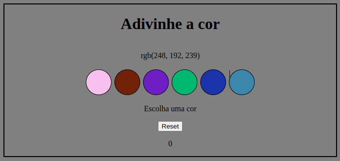

# README: Guess the color



## Project Description

This is a small project where you try to determine the color represented by RGB numbers. Additionally, there is a scoring system that awards you three points each time you guess correctly.

### Technologies

- LINUX
- VSCODE
- HTML
- CSS
- JAVASCRIPT

### What I Learned

- How to work with random numbers logic.
- How to work with conditionals in event listener

## How to Run the Project

1. Clone the repository:

   ```bash
   git clone https://github.com/feduarte-dev/color-guess
   ```

2. Navigate to the project directory:

   ```bash
   cd your-repository
   ```

3. Install dependencies:

   ```bash
   npm install
   ```

## Contributions

[Felipe](https://www.linkedin.com/in/feduarte-dev/) - index.html - style.css - script.js


[Trybe](https://www.betrybe.com/) - Everything else
